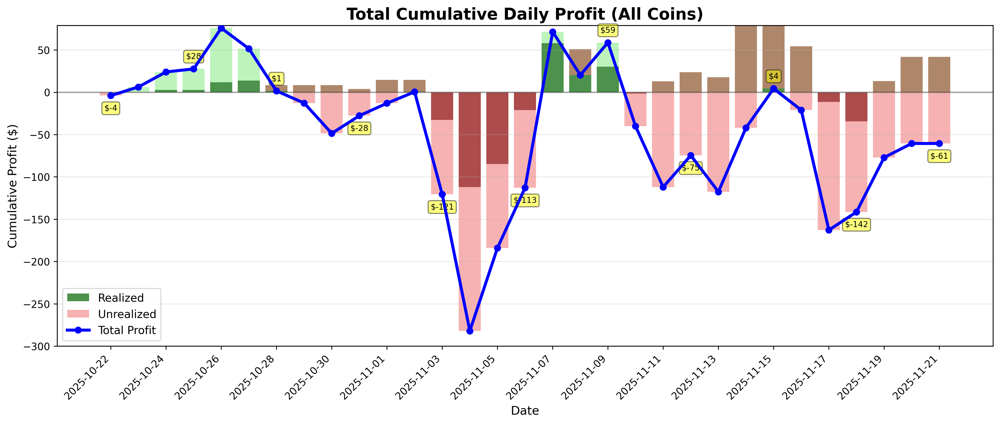
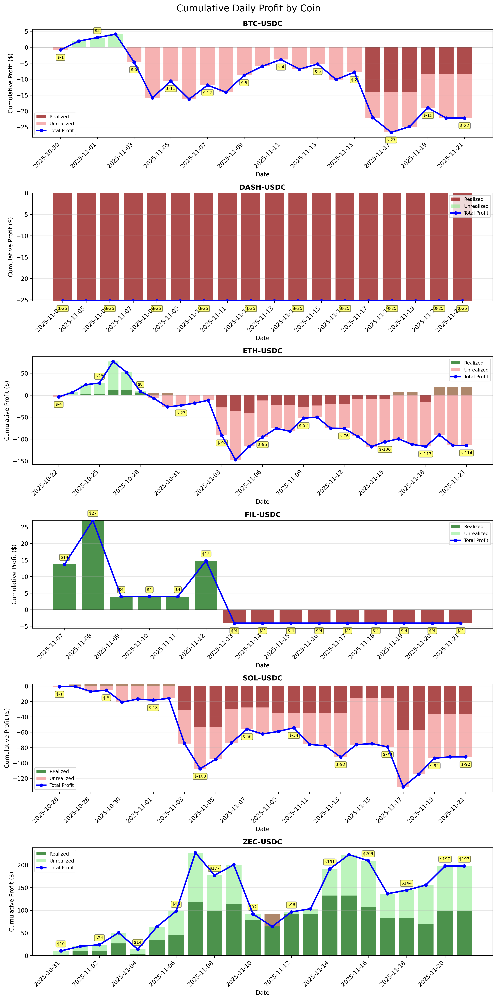
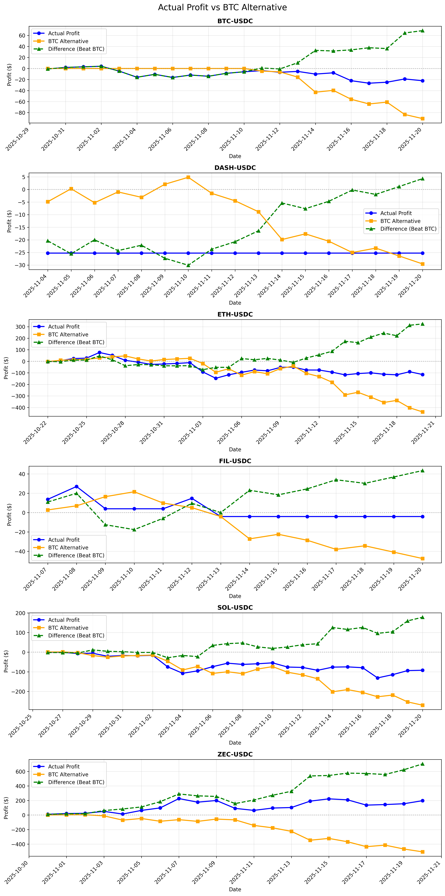

# CoinbaseTradeTracker

A comprehensive cryptocurrency trade tracker using the Coinbase Advanced Trade API. Track your trading performance, compare against BTC baseline, analyze historical profits, and visualize your portfolio growth over time.

## Features

- 📊 **Real-time Profit Tracking**: Calculate realized and unrealized profits for all your trades
- 📈 **Historical Analysis**: Generate daily historical profit data with actual market prices
- 🎯 **BTC Baseline Comparison**: Compare your trading performance against a BTC-only investment strategy
- 📉 **Ticker Performance Analysis**: Evaluate each coin's trading ROI vs simple HODL strategy
- 📊 **Automated Visualizations**: Generate combined bar and line charts showing profit trends
- 🤖 **Automated Daily Updates**: Set up automatic data collection and chart generation at midnight
- 💾 **Persistent Data Storage**: All trade history, profit data, and charts are saved locally

## Project Structure

```
CoinbaseTradeTracker/
├── get_filled_history.py          # Fetch trade history from Coinbase API
├── calculate_profit_history.py    # Calculate current profit with all comparisons
├── calculate_profit_by_date.py    # Calculate historical profit using historical prices
├── generate_daily_history.py      # Generate profit data for date ranges
├── visualize_profit_history.py    # Create charts from historical data
├── daily_update.py                # Automated daily update script
├── setup_auto_update.sh           # Setup automatic daily updates (macOS launchd)
├── utils.py                        # Utility functions
├── trade_history/                  # Trade data from Coinbase API
├── profit_history/                 # Historical profit data (profit_begin_YYYYMMDD.json)
├── comparison/                     # Historical comparison data
├── charts/                         # Generated visualization charts
└── logs/                          # Log files from automated updates
```

## Setup

### 1. Clone the Repository
```bash
git clone https://github.com/echo17666/CoinbaseTradeTracker.git
cd CoinbaseTradeTracker
```

### 2. Create Conda Environment
```bash
conda create -n trade python=3.12 -y
conda activate trade
```

### 3. Install Dependencies
```bash
pip install -r requirements.txt
```

### 4. Configure API Credentials
Create a `.env` file in the root directory with your Coinbase API credentials:
```env
COINBASE_API_KEY=your_api_key_here
COINBASE_API_SECRET=your_api_secret_here
```

**To get your API credentials:**
1. Go to [Coinbase Advanced Trade](https://www.coinbase.com/settings/api)
2. Create a new API key with "View" permissions for trade data
3. Copy the API Key and API Secret to your `.env` file

### 5. Initial Data Fetch

First delete existing data (if any) in the `trade_history/`, `profit_history/`, `comparison/`, and `charts/` directories to start fresh.

Then run:
```bash
# Fetch all trade history
python get_filled_history.py

# Calculate current profit
python calculate_profit_history.py

# Generate historical data (e.g., last 30 days)
python generate_daily_history.py

# Create visualization charts
python visualize_profit_history.py
```

## Automated Daily Updates

There are two ways to automate daily updates:

### Option 1: Local Machine Automation

Your computer runs the updates. **Requirements**: Computer must be powered on.

#### macOS (using launchd)
```bash
# Run the setup script
./setup_auto_update.sh
```

The script will:
- Create a launchd plist file
- Schedule daily updates at 00:00 (midnight)
- Save logs to `./logs/` directory

**Useful commands:**
```bash
# Check if auto-update is running
launchctl list | grep coinbase.tradetracker

# View logs
tail -f logs/daily_update_*.log

# Stop auto-update
launchctl unload ~/Library/LaunchAgents/com.coinbase.tradetracker.plist

# Start auto-update
launchctl load ~/Library/LaunchAgents/com.coinbase.tradetracker.plist

# Run update manually
python daily_update.py
```

#### Linux (using cron)
```bash
# Edit crontab
crontab -e

# Add this line (replace paths with your actual paths):
0 0 * * * cd /path/to/CoinbaseTradeTracker && /path/to/conda/envs/trade/bin/python daily_update.py >> logs/cron.log 2>&1
```

#### Windows (using Task Scheduler)
1. Open Task Scheduler
2. Create a new task
3. Set trigger to daily at midnight
4. Set action to run: `python.exe C:\path\to\CoinbaseTradeTracker\daily_update.py`
5. Set start in: `C:\path\to\CoinbaseTradeTracker`

---

### Option 2: GitHub Actions (Cloud Automation)

Run updates in the cloud - works even when your computer is off!

**Pros:**
- ✅ Runs automatically without your computer
- ✅ Free for public repositories
- ✅ Data and charts automatically committed to repo

**Cons:**
- ⚠️ Your trade data will be stored in the GitHub repository
- ⚠️ API keys stored as GitHub Secrets (secure, but in cloud)
- ⚠️ **Recommendation**: Use a **private repository** for sensitive financial data

**Setup:**
See the detailed guide: [GITHUB_ACTIONS_SETUP.md](GITHUB_ACTIONS_SETUP.md)

**Quick Overview:**
1. Add your Coinbase API credentials as GitHub Secrets
2. Enable GitHub Actions workflow permissions
3. Push the `.github/workflows/daily_update.yml` file
4. Workflow runs automatically at midnight UTC daily


## Usage

### Manual Updates

**Fetch latest trades:**
```bash
python get_filled_history.py
```

**Calculate current profit:**
```bash
python calculate_profit_history.py
```

**Generate historical data for a date range:**
```python
# Edit generate_daily_history.py and modify:
from datetime import date

start = date(2024, 11, 1)  # Start date
end = date(2024, 11, 30)   # End date
generate_daily_history(start, end)
```
Then run:
```bash
python generate_daily_history.py
```

**Create visualization charts:**
```bash
python visualize_profit_history.py
```

### Understanding the Data Files

**Trade History** (`trade_history/`)
- `filled_alltime.json`: All trades from Coinbase API
- `filled_YYYYMMDD_YYYYMMDD.json`: Trades within specific date range

**Profit History** (`profit_history/`)
- `profit_alltime.json`: Current profit using current market prices
- `profit_begin_YYYYMMDD.json`: Cumulative profit from start to specific date (using historical prices)

**Comparison Data** (`comparison/`)
- `comparison_alltime.json`: Current performance comparisons
- `comparison_begin_YYYYMMDD.json`: Historical comparison data

**Charts** (`charts/`)
- `total_daily_profit.png`: Overall portfolio profit (bar + line chart)
- `daily_profit_all_coins.png`: Per-coin profit breakdown (bar + line chart)
- `vs_btc_all_coins.png`: Performance vs BTC baseline
- `roi_comparison_all_coins.png`: Trading ROI vs HODL ROI

## Output

### Console Output

When running `calculate_profit_history.py`, you'll see:

**1. Profit Summary**
```
Coin       Realized        Unrealized      Total          
------------------------------------------------------------
ETH        $        -0.24 $      -111.80 $      -112.04
USDC       $         0.00 $         0.00 $         0.00
FIL        $        -4.08 $        -0.00 $        -4.08
DASH       $       -25.27 $         0.00 $       -25.27
BTC        $        -8.54 $        -9.84 $       -18.38
SOL        $       -36.17 $       -57.46 $       -93.63
ZEC        $        69.71 $       108.10 $       177.81
------------------------------------------------------------
TOTAL      $        -4.58 $       -71.00 $       -75.58
```

**2. BTC Baseline Comparison**
```
======================================================================
BTC BASELINE COMPARISON (If All Investments Were in BTC)
======================================================================

Total Net Investment: $1,378.11
BTC Price (at first trade): $108,092.02
BTC Price (Current): $92,476.90

If All Invested in BTC:
  BTC Amount: 0.01274939 BTC
  Current Value: $1,179.02
  Profit: $-199.08
  ROI: -14.45%

Actual Trading Strategy:
  Total Profit: $-75.11
  ROI: -5.45%

📈 Strategy Outperforms BTC
Difference: $123.97 (+62.27%)
======================================================================
```

**3. Ticker Performance Analysis**
```
==================================================================================================================================
TICKER PRICE vs TRADING PERFORMANCE
==================================================================================================================================

Coin   Start Time           Start $    Current $  Price Change Net Investment My ROI    Difference Status    
----------------------------------------------------------------------------------------------------------------------------------
ETH    2025-10-22T00:34:38  $3841.00  $3036.32   📉-20.95%     $704.28       ❌-15.91%  🟢 +5.04%   Holding   
FIL    2025-11-07T16:15:06  $2.62     $1.87      📉-28.72%     $454.79       ❌ -0.90%  🟢+27.83%   Holding   
BTC    2025-10-30T14:24:34  $107861   $92029     📉-14.68%     $211.82       ❌ -8.68%  🟢 +6.00%   Holding   
SOL    2025-10-26T18:26:33  $199.19   $137.11    📉-31.17%     $288.20       ❌-32.49%  🔴 -1.32%   Holding   
ZEC    2025-10-31T17:29:06  $373.88   $676.98    📈 81.07%     $336.96       ✅ 52.77%  🔴-28.30%   Holding   
----------------------------------------------------------------------------------------------------------------------------------

📊 Statistics:
Profitable Coins: 1/7 (14.3%)
Beat HODL: 4/7 (57.1%)
Average Price Change: -3.58%
Average Trading ROI: -2.36%
Total Profit: $-75.58
Overall ROI: -3.41%
==================================================================================================================================
```

**4. Per-Ticker BTC Comparison**
```
==========================================================================================
TICKER vs BTC COMPARISON (Each ticker uses its own first trade time)
==========================================================================================

Coin   Start Time           Actual      If BTC      Difference  Better?   
------------------------------------------------------------------------------------------
ETH    2025-10-22T00:34:38  $-112.04   $-367.59    $255.55     ✅         
FIL    2025-11-07T16:15:06  $-4.08     $-39.41     $35.33      ✅         
BTC    2025-10-30T14:24:34  $-18.38    $-81.70     $63.31      ✅         
SOL    2025-10-26T18:26:33  $-93.63    $-249.43    $155.80     ✅         
ZEC    2025-10-31T17:29:06  $177.81    $-451.97    $629.78     ✅         
------------------------------------------------------------------------------------------

Coins Outperforming BTC: 7/7 (100.0%)
==========================================================================================
```

### Visualization Charts

All charts combine **stacked bar charts** (showing realized/unrealized breakdown) with **line charts** (showing total profit trend):

**Color Scheme:**
- **Bar Charts:**
  - Dark Green: Realized profit (positive)
  - Dark Red: Realized loss (negative)
  - Light Green: Unrealized profit (positive)
  - Light Coral: Unrealized loss (negative)
- **Line Chart:**
  - Blue line: Total cumulative profit
  - Yellow labels: Dollar values at key points

**Generated Charts:**
1. `total_daily_profit.png`: Portfolio-wide cumulative profit over time

2. `daily_profit_all_coins.png`: Per-coin profit breakdown

3. `vs_btc_all_coins.png`: Your profit vs BTC alternative for each coin

4. `roi_comparison_all_coins.png`: Trading ROI vs price change (HODL ROI)


## How It Works

### 1. Data Collection (`get_filled_history.py`)
- Connects to Coinbase Advanced Trade API
- Fetches filled orders (buy/sell transactions)
- **Incremental Mode**: Merges new trades with existing data to avoid losing history
  - Coinbase API limit: 2000 trades per request
  - Daily updates use incremental mode to preserve all historical trades
  - Detects duplicates using trade time, product ID, side, and price
- Saves to `trade_history/filled_alltime.json`

### 2. Profit Calculation (`calculate_profit_history.py`)
- **Realized Profit**: Profit from completed trades (sold positions)
- **Unrealized Profit**: Current value - cost basis for holdings
- Uses current market prices from Coinbase API
- Compares performance against BTC baseline and HODL strategy

### 3. Historical Tracking (`calculate_profit_by_date.py`)
- For each historical date, fetches the actual market price at end of day
- Calculates profit as if you checked your portfolio on that date
- Generates cumulative profit data (all trades from start to that date)
- Uses historical 1-minute candle data for accurate pricing

### 4. Visualization (`visualize_profit_history.py`)
- Reads all `profit_begin_*.json` files
- Creates combined bar + line charts:
  - **Bars**: Show realized/unrealized composition
  - **Line**: Show total profit trend
- Saves high-resolution charts (300 DPI)

### 5. Automation (`daily_update.py`)
- Runs all scripts in sequence
- Uses incremental mode to preserve all trade history
- Logs output to `logs/` directory
- Updates historical data with today's snapshot
- Regenerates all charts

## Key Concepts

### Realized vs Unrealized Profit
- **Realized**: You've sold and locked in the profit/loss
- **Unrealized**: You still hold the asset, profit/loss can change

### Cost Basis
- Average price you paid for an asset
- Used to calculate unrealized profit: `(current_price - avg_buy_price) × quantity`

### ROI (Return on Investment)
```
ROI = (Total Profit / Net Investment) × 100%
```

### BTC Baseline
- Hypothetical scenario: What if you invested everything in BTC?
- Compares your actual performance to this "passive" strategy
- Helps evaluate if your trading strategy adds value

### HODL vs Trading ROI
- **HODL ROI**: Just buy and hold (price change %)
- **Trading ROI**: Your actual trading performance
- Positive difference = Your trading beats simple HODL

## Troubleshooting

### "No API credentials found"
- Make sure `.env` file exists in project root
- Check that `COINBASE_API_KEY` and `COINBASE_API_SECRET` are set

### "Failed to fetch historical price"
- Coinbase API rate limits may apply
- Wait a few seconds and retry
- Check your internet connection

### Charts not generating
- Make sure `matplotlib` is installed: `pip install matplotlib`
- Check that historical data exists in `profit_history/`
- View logs in `logs/` directory for error details

### Auto-update not running
- **macOS**: Check launchd status with `launchctl list | grep coinbase`
- **Linux**: Check cron logs with `grep CRON /var/log/syslog`
- Make sure conda environment path in setup script is correct

## Advanced Configuration

### Modify Date Ranges
Edit `generate_daily_history.py`:
```python
from datetime import date

# Generate last 90 days
start_date = date(2024, 9, 1)
end_date = date(2024, 11, 30)
generate_daily_history(start_date, end_date)
```

### Change Update Schedule
Edit `setup_auto_update.sh` to modify the hour/minute:
```xml
<key>StartCalendarInterval</key>
<dict>
    <key>Hour</key>
    <integer>6</integer>  <!-- 6 AM instead of midnight -->
    <key>Minute</key>
    <integer>30</integer>  <!-- 30 minutes past the hour -->
</dict>
```

### Customize Chart Appearance
Edit `visualize_profit_history.py` to change:
- Colors: Modify `realized_colors` and `unrealized_colors`
- Figure size: Change `figsize=(14, 6)`
- DPI: Modify `dpi=300` in `plt.savefig()`

## Contributing

Contributions are welcome! Please feel free to submit a Pull Request.

## License

This project is licensed under the MIT License - see the [LICENSE](LICENSE) file for details.

## Disclaimer

This tool is for personal portfolio tracking only. It is not financial advice. Always verify important financial data independently. Past performance does not guarantee future results.

## Author

Created by [echo17666](https://github.com/echo17666)

## Support

If you find this project helpful, please give it a ⭐ on GitHub!